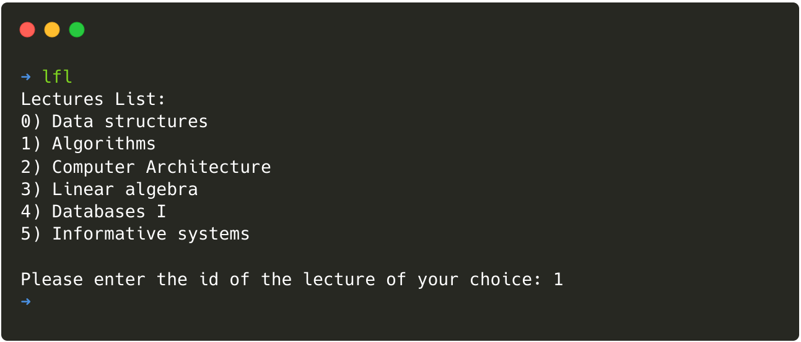
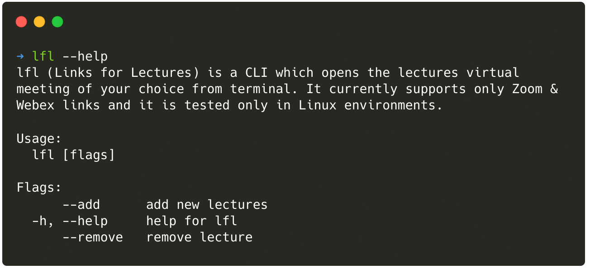
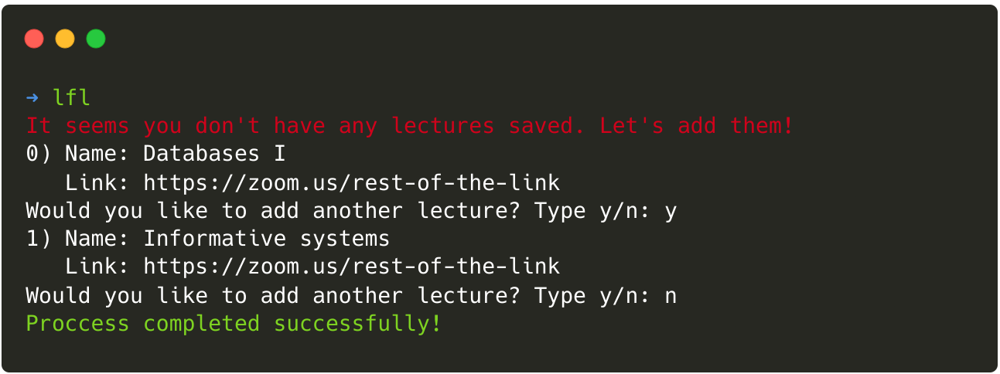
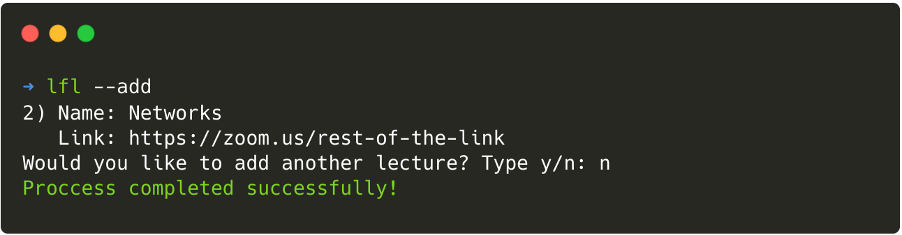
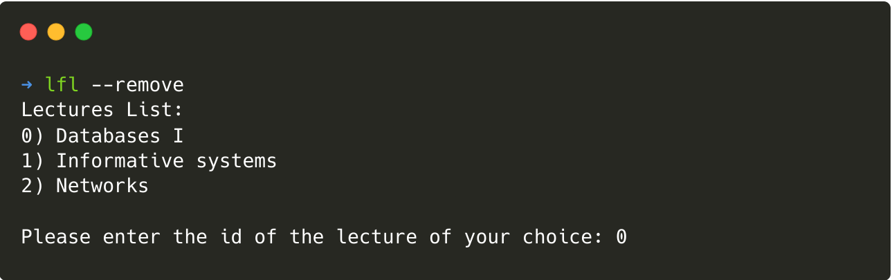

# lfl - Links for Lectures

## Demonstation
lfl (Links for Lectures) is a CLI which opens the lectures' virtual meeting of your choice
from terminal. It currently supports only Zoom & Webex links and is tested only in Linux environments.

<p align="center">
  
</p>

## Installation
lfl is tested only in Linux environments. Please, use the instructions below to install it on your system.

### Debian & Debian-Based distributions
```
➜ wget https://raw.githubusercontent.com/Stavrospanakakis/lfl/main/build/Makefile && make debian
```

### Arch & Arch-Based distributions
```
➜ wget https://raw.githubusercontent.com/Stavrospanakakis/lfl/main/build/Makefile && make arch
```

## Usage

### Manual

<p align="center">
  
</p>

### First time running lfl

<p align="center">
  
</p>

### Add lectures

<p align="center">
  
</p>


### Remove lectures

<p align="center">
  
</p>


